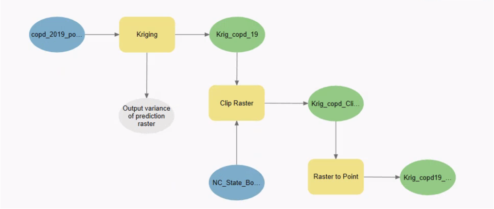

# Analysis of the Association Between Air Pollution and Risk of Chronic Obstructive Pulmonary Disease in North Carolina with GIS

## Authors
Wan-Ting Liao, Madeline Vessey

## Project Overview
Chronic lower respiratory diseases (CLRD), including chronic obstructive pulmonary disease (COPD), asthma, pulmonary hypertension, and occupational lung diseases, were the sixth leading cause of death in North Carolina in 2020, according to the CDC. Among these, COPD accounts for the majority of cases. While tobacco smoking is the primary cause, long-term exposure to air pollutants or lung irritants may also contribute to its development.

The purpose of this project is to assess whether the high COPD prevalence rate in North Carolina is associated with air quality. Specifically, we analyze the Air Quality Index (AQI) and COPD prevalence rates from 2017 to 2019, focusing on two common air pollutants: NO2 and SO2. While this project does not identify fundamental causes of air pollution, it aims to encourage local governments to investigate potential contributors to poor air quality and develop solutions to mitigate related health problems.

## Data Sources
- **EPA Air Quality Sensors and AQI Summaries (2017 - 2019)**
  - SO2: Sensor locations and AQI contribution values
  - NO2: Sensor locations and AQI contribution values
- **CDC PLACES Collaboration (2017 - 2019)**
  - County-level COPD prevalence rate data
- **Related Literature**
  - "A GIS Based Approach for Assessing the Association between Air Pollution and Asthma in New York State, USA" ([DOI:10.3390/ijerph110504845](https://doi.org/10.3390/ijerph110504845))

## Methodology

1. **Step 1:**
   - Apply the Kriging model for spatial interpolation
   - Extract selected points from raster data
2. **Step 2:**
   - Convert shapefile (shp) to CSV format
3. **Step 3:**
   - Data preprocessing and cleaning
4. **Step 4:**
   - Perform correlation analysis between air quality (SO2, NO2) and COPD prevalence

## Results
- **Spatial Interpolation Map (2017-2019):**
  - SO2 and NO2 in NC
  ![images/so2.png]  ![images/no2.png]
  - COPD in NC
  ![images/copd_2017.png] ![images/copd_2018.png] ![images/copd_2019.png]
- **Correlation Analysis (2017 - 2019):**
  - In 2017, a negligible positive relationship was found between SO2 and NO2 and COPD prevalence.
  - In 2018, a moderate positive relationship was observed.
  - In 2019, a high positive relationship was found.
  - The differences from 2017 to later years may be attributed to the lack of COPD prevalence data for some counties in 2017.

## Limitations
- **Pollution Data:**
  - Limited number of sensors and recorded pollutant contributions to AQI.
  - NO2 datasets contained a maximum of 4 sensor points per year.
  - SO2 datasets contained a maximum of 14 sensor points per year.
  - Sensor locations varied yearly, and some stopped recording between 2017-2019.
- **COPD Data:**
  - Missing COPD prevalence data for several counties in 2017.

## Future Directions
- Use multiple interpolated values per county instead of a single point for more robust correlation analysis.
- Investigate the effects of additional pollutants, such as Ozone or PM2.5, on COPD prevalence in North Carolina.

## Conclusion
Our analysis found a medium to high correlation between NO2, SO2, and COPD prevalence in 2018 and 2019, suggesting that air pollution may be a contributing factor to COPD risk. Further research incorporating more pollutants and additional years of data is needed to confirm these findings.

